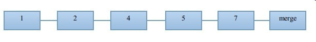

##Git的介绍

Git是一个开源的分布式版本控制系统，用以有效、高速的处理从很小到非常大的项目版本管理。

##Git的安装
>````sudo apt-get install git-core #linux````

##Git的初始化和配置
###配置Git

>````git config --global user.name "wallace liu" #配置本地git账户的姓名````

>````git config --global user.email "wallaceliu@anjuke.com" #配置本地git账户的邮件````

###初始仓库
>````git clone git@git.corp.anjuke.com:site/anjuke-broker anjuke_broker #克隆远程库的代码到本地的anjuke_broker目录````

###创建分支

取回远程库上的分支,并创建对应的本地分支(假设:远程分支号pmt16825)

>````git fetch origin #取回远程origin库上的分支和更新````

>````git checkout -b lpmt16825 origin/pmt16825 #取回远程origin库pmt16825分支的代码到本地,并生成本地lpmt16825分支````

>````git checkout lpmt16825 #切换本地工作的分支到lpmt16825````

###Coding
>````.... (假设:更改readme文件)````

###提交代码到本地仓库和远程仓库
>````git add readme #添加修改到git的暂存区````

>````git commit -m "修改了readme文件" #添加修改到git的本地仓库````  

>````git push origin lpmt16825:pmt16825 #将本地lpmt16825的代码更新到远程origin仓库的pmt16825分支````

###合并分支到主线(假设:当前分支是在lpmt16825)
>````git rebase origin/master #将主线上最新的代码更新到当前分支````

>注1: 这里进行了rebase,可以避免后面master分支中````merge lpmt16825````时产生冲突.

>注2: 如果当前分支和主线对同一个文件进行了修改时,就有可能产生冲突,要先用````git mergetool````解决冲突,然后再用````git rebase --continue````继续进行rebase

>注3: 这里也可以利用````git merge````获取主线的最新更新,但是这样会导致后面主线````merge````了当前分支之后,提交线会变得很难看,不便于以后的代码追踪

>````git push origin lpmt16825:pmt16825 -f #强制更新远程库````

>````git checkout master #切换到master分支````

>````git merge lpmt16825 #合并lpmt16825到master分支````

>````git push origin master #把本地master推送到远程仓库````

###Git的一些基本命令
>````git remote [-v] #显示所有的远程仓库````

>````git remote add <name> <url> #添加远程仓库````

>````git remote rm <name> #删除相应的远程仓库````

>````git branch [-v] #显示所有的本地分支````

>````git branch [-r] #显示所有的远程分支````

>````git branch <branchname> #创建相应的本地分支````

>````git branch [-d|D] <branchname> #删除相应的本地分支````
        
>````git checkout <branchname> #切换到相应分支````

>````git chechout [-b] <branchname> <repository>/<branchname> #创建对应的本地分支,并获取对应远程分支的代码````

>````git add [filename | .] #添加相应文件到暂存区````

>````git commit [-m] <comment> #将暂存区的更改添加到本地仓库````

>````git log #列出当前分支的提交记录````

>````git push <repository> <local branchname>:<branchname> #将本地分支的内容推送到对应的远程分支,如果远程分支不存在则创建对应的远程分支````

>````git push <repository> :<branchname> # 删除远程仓库分支````

>````git merge <branchname> #合并对应分支到当前分支````

>````git rebase <branchname> #将对应分支的变更衍生到当前分支````

###git的一些工具

>gitg 一款图形化的git工具

>tig 一款命令行的git工具


###rebase和merge的区别
>####对分支线的影响
>假设一个git本地库的分支如下:

>

>上面数字的顺序代表着提交的时间顺序


>做如下操作

>>````git checkout branch1````

>>````git rebase master````

>branch1中的提交记录为

>>

>做如下操作

>>````git checkout branch2````

>>````git merge master````

>branch1中的提交记录为

>>

>由上面的结果可以得知
>>git rebase是按照分支内部的提交顺序来重新组织提交顺序

>>git merge是按照提交的时间顺序来重新组织提交顺序

>>git merge会新增一个提交记录这次合并

>所以在平时的开发中,需要获取主线的最新代码时,请使用rebase而不是merge,这样使得代码回滚变得很轻松